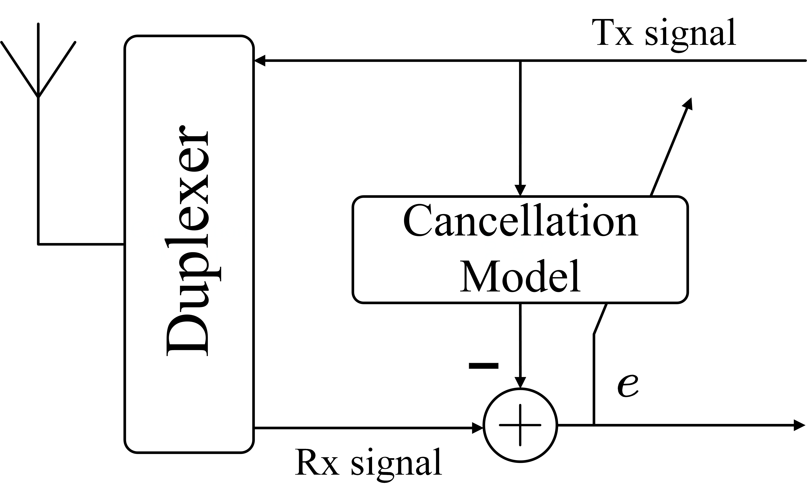
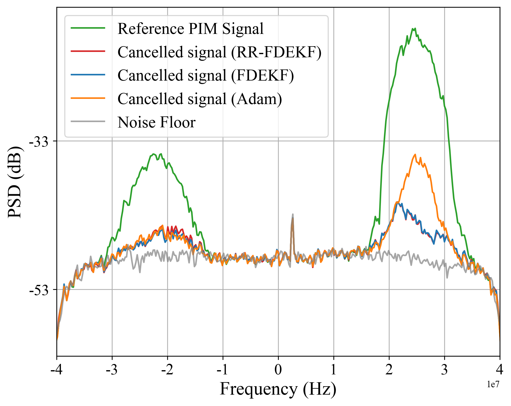
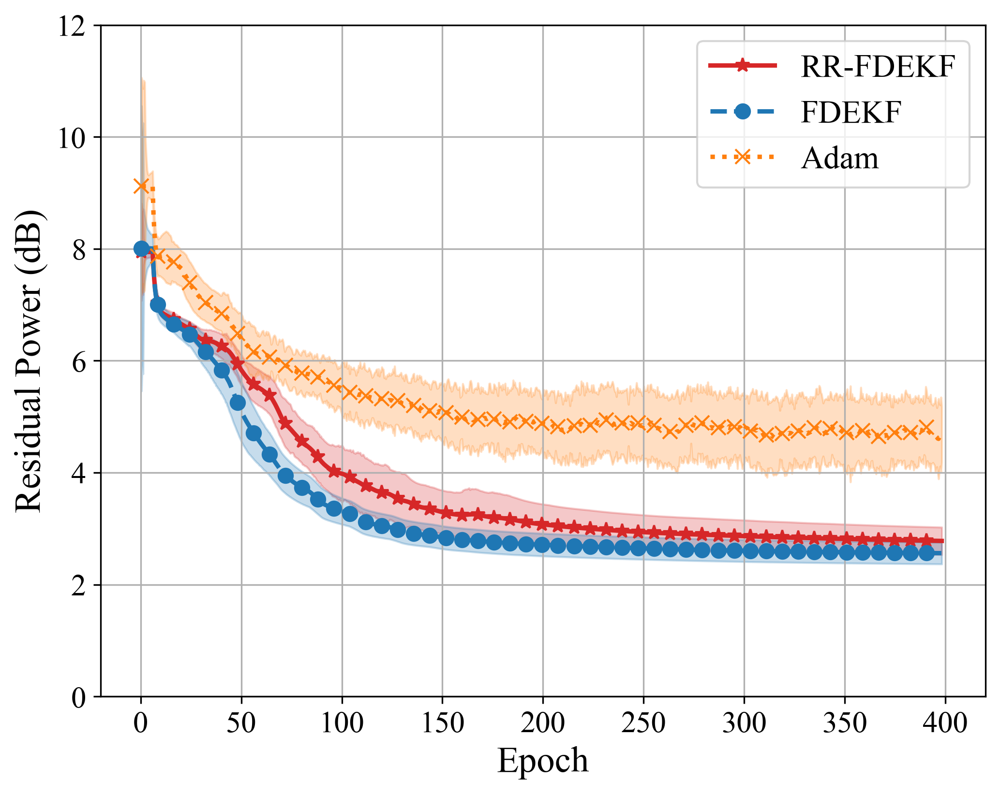

# 摘要 (Abstract)

本文阐明了扩展卡尔曼滤波器（EKF）在非线性系统辨识中作为学习率的物理含义。为了处理数据快速到达的应用场景，我们将完全解耦扩展卡尔曼滤波器（FDEKF）改进为一种新算法，称为循环完全解耦扩展卡尔曼滤波器（RR-FDEKF）。该算法在参数更新中引入了循环（Round-Robin）机制，利用一种专门构造的混合信息状态向量来立即使用新的测量信息。FDEKF 和 RR-FDEKF 的有效性在无源互调（PIM）抵消这一无线通信中的挑战性现实任务中得到了验证。实验结果表明，与深度学习中广受认可的 Adam 优化器相比，它们实现了更优的 PIM 抑制效果，并具有显著的计算优势。这些发现凸显了 FDEKF 和 RR-FDEKF 作为高效且高性能的在线非线性参数估计解决方案的潜力。

# I. 引言 (Introduction)

系统辨识是构建动态系统数学模型，并随后从观测数据中估计模型参数的过程。它是众多科学和工程领域（包括控制系统、信号处理、计量经济学和机器学习）中的基础性挑战。虽然模型的架构确立了可实现的模型性能上限，但参数估计决定了性能的下限，即已辨识模型的实际保真度。

本文针对无线通信中无源互调（PIM）失真的缓解这一具体问题，探讨了高效且准确的参数估计框架。PIM 固有的复杂行为和记忆效应通常需要高维非线性模型。卡尔曼滤波框架是状态和参数估计的基石，但在应用于高维系统辨识时面临 $O(n^2)$ 的计算复杂度。

为了克服这些挑战，本文：
1.  **提出了 EKF 更新机制的新解释**：将其卡尔曼增益视为一种可解释的、自适应的学习率。
2.  **形式化了 FDEKF 并提出了 RR-FDEKF**：为 FDEKF 建立了状态空间推导，并提出了适应高速数据流的 RR-FDEKF。
3.  **验证了在 PIM 抵消中的性能**：证明了所提方法优于 Adam 优化器。

# II. EKF 与 LMS：学习率的解读 (EKF Versus LMS: Interpreting Learning Rate)

## A. 问题描述
参数估计的目标是找到估计值 $\hat{\boldsymbol{\theta}}$，使模型输出尽可能接近系统输出数据。对于非线性模型，常用梯度下降法（如 LMS 或 Adam），其依赖于启发式的学习率。相比之下，EKF 提供了一种基于概率推断的根本不同的范式。

*Fig. 1. 参数估计过程的概念图.*

## B. 用于参数估计的 EKF
将参数 $\boldsymbol{\theta}$ 视为状态，EKF 通过预测和更新两个阶段递归地估计参数。其核心在于 **卡尔曼增益 $\mathbf{K}_k$**，它不是静态的人工超参数，而是每一时间步动态重算的最佳自适应学习率矩阵。

## C. 可解释的自适应学习率
EKF 通过三个核心协方差矩阵动态调整其“学习率”：
*   **状态误差协方差矩阵 ($\mathbf{P}_k$)**：量化参数估计的不确定性。$\mathbf{P}_k$ 越大，不确定性越高，滤波器越信任新测量值（$\mathbf{K}_k$ 变大）。
*   **过程噪声协方差矩阵 ($\mathbf{Q}_k$)**：代表真实参数随时间的随机变化。$\mathbf{Q}_k$ 越大，表示系统扰动越大，允许更显著的参数变化。
*   **测量噪声协方差矩阵 ($\mathbf{R}_k$)**：量化测量噪声。$\mathbf{R}_k$ 越大，表示测量不可靠，滤波器会降低对测量的权重（$\mathbf{K}_k$ 变小）。

这种基于不确定性的动态调整机制使得 EKF 在动态系统中表现优于固定学习率的方法。

# III. 从 FDEKF 到 RR-FDEKF 的演进 (Improving FDEKF Into RR-FDEKF)

## A. 用于参数估计的 FDEKF
为了解决标准 EKF $O(n^2)$ 的计算瓶颈，FDEKF 采用完全解耦策略，忽略参数间的相互依赖，将每个参数视为独立状态。
*   **复杂度降低**：通过将 $n$ 维 EKF 拆分为 $n$ 个标量 EKF，复杂度由 $O(n^2)$ 降至接近 $O(n)$。
*   **局限性**：在每一时间步 $k$，仍需使用测量值 $\mathbf{y}_k$ 更新所有 $n$ 个参数。在高速数据流场景下，计算时间可能跟不上数据到达速度。

## B. 用于参数估计的 RR-FDEKF
为了进一步适应高速在线应用，本文提出了 **RR-FDEKF**（循环完全解耦 EKF）。
*   **核心思想**：每个物理测量数据仅用于更新 **一个** 参数。
*   **循环机制**：建立逻辑处理周期，参数 $i=1 \dots n$ 依次更新。
*   **混合周期信息向量 ($\boldsymbol{\xi}^i_k$)**：在更新第 $i$ 个参数时，利用同一周期内刚刚更新过的参数 $\hat{\theta}^1_k, \dots, \hat{\theta}^{i-1}_k$ 和上一周期的参数 $\hat{\theta}^{i+1}_{k-1}, \dots, \hat{\theta}^n_{k-1}$。这种信息级联加速了收敛。

*Fig. 2. RR-FDEKF 在第 k 个处理周期内的概念图解.*

# IV. 实验验证 (Experimental Validation)

## A. 实验设置
实验使用真实的无线通信 PIM 数据，采用 symmetrized Basis Function Approximation Network (BFAN) 模型（$n=232$ 个参数）。
*   **对比算法**：Adam (Baseline), FDEKF, RR-FDEKF。
*   **评价指标**：残差 PIM 功率 (dB)，平均执行时间。

*Fig. 3. 数字 PIM 抵消系统设置框图.*

## B. 结果与分析
实验结果表明，两种解耦卡尔曼滤波方法均显著优于 Adam。
1.  **残差 PIM 功率**：
    *   **PSD 分析 (Fig. 4)**：FDEKF 和 RR-FDEKF 的残差误差远低于 Adam。
    *   **收敛曲线 (Fig. 5)**：得益于自适应学习率机制，KF 方法在早期迭代中残差下降极快，且最终误差更低、稳定性更高（方差更小）。

*Fig. 4. 参考 PIM 信号及 FDEKF, RR-FDEKF, Adam 抵消后残余信号的功率谱密度.*

*Fig. 5. PIM 抵消中 FDEKF, RR-FDEKF 和 Adam 的残差功率 (dB) 随训练 epoch 的变化.*

2.  **计算效率**：
    *   FDEKF 的运行时间与高度优化的 Adam 相当。
    *   RR-FDEKF **最为高效**，每 epoch 仅需 60.78s（比 FDEKF 快 1.16 倍），证明了其顺序更新结构的优势。

# V. 结论 (Conclusion)

FDEKF 和 RR-FDEKF 为深度学习领域常用的启发式优化器（如 Adam）提供了具有清晰理论基础的替代方案。特别是在数字 PIM 抵消等高数据率、高维参数的在线辨识任务中，RR-FDEKF 凭借其顺序单参数更新机制，能够在保证甚至超越 Adam 性能的同时，显著提升计算效率。

---

# VI. 个人阅读与深度解析 (Personal Reading)

## 背景算法 (Baseline Algorithms)

### 1. 传统梯度下降与 LMS

在非线性系统辨识中，除了使用解析解（仅适用于线性系统的 RLS），常用的替代方法是基于梯度的算法，如最小均方（LMS）算法或 Adam 优化器。LMS 依赖于固定的学习率 $\mu$，其更新公式为：

$$
\hat{\boldsymbol{\theta}}_k = \hat{\boldsymbol{\theta}}_{k-1} + \mu \mathbf{H}_k^T (\mathbf{y}_k - f(\hat{\boldsymbol{\theta}}_{k-1}; \mathbf{x}_k, \dots))
$$

虽然计算简单，但固定学习率在面对非平稳信号或复杂环境时难以平衡收敛速度和稳定性。Adam 优化器则是深度学习中广泛使用的基准，具有启发式的自适应学习率机制。

### 2. 标准扩展卡尔曼滤波 (Standard EKF)

EKF 将参数估计重新构建为状态空间模型中的概率推断问题。它通过协方差矩阵动态调整增益（即学习率）。

* **预测步骤**:

  $$
  \hat{\boldsymbol{\theta}}_{k|k-1} = \hat{\boldsymbol{\theta}}_{k-1} 
  $$

  $$
  \mathbf{P}_{k|k-1} = \mathbf{P}_{k-1} + \mathbf{Q}_{k-1}
  $$
* **更新步骤**:

  $$
  \mathbf{K}_k = \mathbf{P}_{k|k-1} \mathbf{H}_k^T (\mathbf{H}_k \mathbf{P}_{k|k-1} \mathbf{H}_k^T + \mathbf{R}_k)^{-1}
  $$

  $$
  \hat{\boldsymbol{\theta}}_k = \hat{\boldsymbol{\theta}}_{k|k-1} + \mathbf{K}_k (\mathbf{y}_k - f(\hat{\boldsymbol{\theta}}_{k|k-1}; \dots))
  $$

  $$
  \mathbf{P}_k = (\mathbf{I} - \mathbf{K}_k \mathbf{H}_k) \mathbf{P}_{k|k-1}
  $$

**局限性**: EKF 实际上被限制于高维系统，因为其计算复杂度和存储需求随参数数量 $n$ 呈 $O(n^2)$ 增长（由于全协方差矩阵 $\mathbf{P}_k$ 的操作）。

## 改进算法 (Improved Algorithms)

为了解决 EKF 的计算瓶颈，本文在完全解耦 EKF (FDEKF) 的基础上提出了 循环完全解耦 EKF (RR-FDEKF)。

### 1. 完全解耦 EKF (FDEKF)

FDEKF 采用完全局部的实现，将每个参数 $\theta^i$ 视为独立的状态。虽然它避免了全局协方差矩阵的计算（复杂度降至 $O(nq^3)$，当输出维数 $q$ 小时约为 $O(n)$），但它仍然在每个时间步 $k$ 使用测量值 $\mathbf{y}_k$ 更新所有 $n$ 个参数。
在数据到达频率极高的场景下，更新所有 $n$ 个参数的处理时间可能超过测量间隔。

### 2. 循环完全解耦 EKF (RR-FDEKF)

为了进一步降低计算负担并适应高速数据流，RR-FDEKF 引入了循环（Round-Robin）更新机制。

* **核心思想**: 每一个测量数据 $\mathbf{y}_{k,i}$ 仅用于更新**一个**参数 $\theta^i$。
* **公式**: 使用“混合周期”信息向量 $\boldsymbol{\xi}^i_k$ 来利用最新的估计值：

  $$
  \boldsymbol{\xi}^i_k = [\hat{\theta}^1_k, \dots, \hat{\theta}^{i-1}_k, \hat{\theta}^{i+1}_{k-1}, \dots, \hat{\theta}^n_{k-1}]^T
  $$

  更新过程（针对第 $i$ 个参数）：
  $$
  \hat{\theta}^i_k = \hat{\theta}^i_{k|k-1} + K_{k,i} (y_{k,i} - f_i(\hat{\theta}^i_{k|k-1}; \boldsymbol{\xi}^i_k, \dots))
  $$
* **优势**: 计算复杂度进一步降低，每个物理时间步仅需 $O(1)$ 的操作（针对单参数更新）。并且通过立即利用同一周期内先前更新的参数信息，加速了收敛。

## EKF → FDEKF → RR-FDEKF：算法演进总结（按“为什么/改了啥/带来啥”）

这条演进线的目标很单一：**保留 EKF 的不确定性驱动更新（Kalman 增益可解释为自适应学习率），同时把高维参数估计的计算代价降下来，直到能跟上高数据率的在线场景。**

### 1) EKF：完整不确定性融合（强，但贵）

- **建模（参数当状态）**：

  $$
  \hat{\theta}_k = \hat{\theta}_{k-1} + w_{k-1},\quad y_k = f(\hat{\theta}_k; x_k,\dots) + v_k
  $$
- **Kernel（自适应学习率矩阵）**：

  $$
  k = P_{k|k-1} H_k^T \big(H_k P_{k|k-1} H_k^T + R_k\big)^{-1}
  $$

  其中 $K_k$ 根据 $P,Q,R$ 自动调节“信任新数据/信任旧估计”的权重。
- **为什么需要演进**：维护并更新完整协方差 $P_k\in\mathbb{R}^{n\times n}$，高维时计算与存储开销近似 $O(n^2)$，在线大模型辨识往往不可承受。

### 2) FDEKF：把“全协方差”砍成“对角协方差”（从 $O(n^2)$ 到近似 $O(n)$）

- **关键改动**：忽略参数间相关性（等价于 $P_k$ 仅保留对角项）。
- **等价实现**：把 $n$ 维 EKF 拆成 $n$ 个标量 EKF，每个参数 $\theta^i$ 自己维护一个标量方差 $P_k^i$。
- **带来的效果**：当测量维数 $q$ 很小（论文 PIM 实验 $q=1$）时，整体复杂度接近线性 $O(n)$。
- **仍然卡住的点**：每来一个样本 $y_k$，仍需要把 $i=1\dots n$ 的参数全更新一遍；在高数据率流式场景里，可能“样本到得比计算快”。

### 3) RR-FDEKF：把“每步全更”改成“每步轮询更一个”（让吞吐跟上数据率）

- **Kernel 改动**：每个物理时间步只更新一个参数，参数索引按 Round-Robin 轮换。
- **为什么不会信息完全断流**：更新第 $i$ 个参数时，构造混合向量
  $$
  i_k^i = [\hat\theta_k^1,\dots,\hat\theta_k^{i-1},\hat\theta_{k-1}^{i+1},\dots,\hat\theta_{k-1}^n]^T
  $$

  让同一“周期”里刚更新过的参数立即参与后续更新，形成信息级联，降低“只更新一个参数”带来的滞后。
- **带来的效果**：单步开销近似 $O(1)$（一条数据只更一个参数）；每 $n$ 个样本完成一轮全参数更新，特别适合低时延/流水线实现。

### 一句话 Kernel 总结

- **EKF**：最完整，但全协方差 $P$ 太贵。
- **FDEKF**：把 $P$ 对角化 → $n$ 个标量 EKF，复杂度近似线性。
- **RR-FDEKF**：在 FDEKF 上再把“每样本更新全部参数”改为“每样本轮询更新一个参数 + 混合向量级联”，适配高速在线数据流。

# Fig 4 参数配置

图 4 展示了参考 PIM 信号的功率谱密度（PSD）以及经 FDEKF、RR-FDEKF 和 Adam 抵消后的残差信号。该实验采用了以下关键参数配置（基于 "B. Evaluation Setup" 章节）：

## 1. 实验环境与通用设置
*   **硬件**: Intel(R) Xeon(R) CPU @ 2.20GHz
*   **软件框架**: PyTorch (Python)
*   **数据集**: 64,800 个样本 (1 epoch)
*   **统计验证**: 20 次随机种子重复实验
*   **参数初始化**: $N(0, 0.01)$

## 2. 算法超参数配置

### Adam (Baseline)
*   **学习率 ($\alpha$)**: $0.001$
*   **指数衰减率**: $\beta_1 = 0.9$, $\beta_2 = 0.999$
*   **$\epsilon$**: $10^{-8}$

### FDEKF & RR-FDEKF
两者配置相同以确保公平对比：
*   **初始参数误差方差 ($P_0^i$)**: $0.01$ (与参数初始化方差一致)
*   **测量噪声方差 ($R_k$)**: $10^{-8}$ (基于接收通道固有噪声计算)
*   **过程噪声方差 ($Q_k^i$) 动态调度**:
    1.  **预热期 (前 10 epochs)**: $Q_k^i = 0$ (加速收敛)
    2.  **激活期**: 增加至 $10^{-6}$ (防止卡尔曼增益消失)
    3.  **衰减期**: 每 50 epochs 衰减 0.7 倍
    4.  **下限**: 最小值为 $10^{-12}$

---

# VII. 通俗解读：EKF → FDEKF → RR-FDEKF 的演进

这一串演进本质上是一场**"为了省钱（算力）和赶时间（实时性）而做的减法运动"**。

## 1. EKF：全能但笨重的"土豪"

**极简背景**：EKF 是老祖宗。它认为所有参数之间都是**有关系**的。比如你想估计"身高"和"体重"，EKF 觉得这两个得一起算，因为高的人通常重。

**核心逻辑**：
*   它维护一个巨大的**关系网（协方差矩阵 $\mathbf{P}$）**。如果你有 $n$ 个参数，它就维护一个 $n \times n$ 的矩阵。
*   **数学痛点**：
    $$ \mathbf{P}_k = n \times n \text{ 矩阵} $$
    每次更新都要做矩阵乘法和求逆。如果 $n=1000$，就要算 $1000 \times 1000$ 的矩阵运算。
    **复杂度**：$O(n^2)$。参数一多，电脑直接卡死。

## 2. FDEKF：各过各的"独行侠"

**极简背景**：为了省算力，FDEKF 决定**摆烂**。它假设："参数之间没关系！身高是身高，体重是体重，互不影响。"

**核心逻辑**：
*   **砍掉关系网**：把那个巨大的 $n \times n$ 矩阵 $\mathbf{P}$，强制变成只有对角线有值的矩阵（或者干脆拆成 $n$ 个单独的数字）。
*   **数学变化**：
    原本的矩阵 $\mathbf{P}$ 变成了 $n$ 个独立的标量 $P^1, P^2, \dots, P^n$。
    $$ P^i_k = \text{标量 (第 } i \text{ 个参数的方差)} $$
*   **优缺点**：
    *   **爽了**：复杂度降到了 $O(n)$。算得飞快。
    *   **痛点**：虽然拆开了，但每来一个数据，它还是要把**所有 $n$ 个参数**都更新一遍。如果数据来得像加特林一样快（高频数据流），CPU 还是处理不过来。

## 3. RR-FDEKF：排队打饭的"流水线"

**极简背景**：这是本文的大招。为了应对极高的数据射速，它采用了**"你可以快，但我一次只做一个"**的策略。

**核心逻辑**：
*   **轮询机制 (Round-Robin)**：数据 $t=1$ 来时，我只更新参数 1；数据 $t=2$ 来时，我只更新参数 2……以此类推。
*   **混合信息向量 ($\boldsymbol{\xi}$)**：这是最精髓的设计！
    你可能会问：*"如果只更新参数 1，那算参数 1 的时候需要用到参数 2、3 的值咋办？"*
    RR-FDEKF 说：*"用旧的啊！或者用刚刚更新热乎的！"*
*   **数学直觉**：
    它构造了一个"拼盘"向量 $\boldsymbol{\xi}_k^i$：
    $$ \boldsymbol{\xi}_k^i = [\underbrace{\hat{\theta}_k^1, \dots, \hat{\theta}_k^{i-1}}_{\text{本轮刚更新的（热乎）}}, \underbrace{\hat{\theta}_{k-1}^{i+1}, \dots, \hat{\theta}_{k-1}^n}_{\text{上一轮留下的（旧的）}}]^T $$
    每次计算只针对**一个**标量 $P^i$ 和 $\theta^i$。
*   **效果**：
    *   **复杂度**：$O(1)$（指每个物理时间步只算一次）。
    *   **奇效**：虽然每次只更一个，但因为用到了刚更新的"热乎"参数，信息流动得很快，反而收敛得比 Adam 还好。

## 总结对比表

| 算法 | 假设 | 协方差 $\mathbf{P}$ 结构 | 每次数据来时干嘛？ | 复杂度/步 | 人话比喻 |
| :--- | :--- | :--- | :--- | :--- | :--- |
| **EKF** | 参数全相关 | 巨大的 $n \times n$ 矩阵 | 更新所有 $n$ 个参数 | **$O(n^2)$** (慢死) | 全班一起通过，互相还要对答案 |
| **FDEKF** | 参数独立 | $n$ 个独立的数字 | 更新所有 $n$ 个参数 | **$O(n)$** (还行) | 全班一起考试，各做各的 |
| **RR-FDEKF** | 参数独立+轮询 | **1 个**数字 (轮着用) | **只更新 1 个参数** | **$O(1)$** (极速) | 这题小明做，下题小红做...接力做 |

---

# VIII. 实体例子：调音台的故事 (A Concrete Example)

为了让你彻底明白，我们不用抽象的数学，而是用**"调音台消除噪音"**这个场景来演示。

假设你是一个演唱会的调音师。你的任务是消除麦克风里的**杂音**（也就是 PIM 抵消）。
你面前有 **3 个旋钮**（参数 $\theta_1, \theta_2, \theta_3$）可以调节。

## 场景：杂音不断地传来...
*   **数据流**：每秒钟传来 1000 段杂音片段（数据来得很快）。

### 1. EKF（完美主义者）
EKF 听到一段杂音后，会开始深思熟虑：
*   **思考**："旋钮 1 和旋钮 2 是不是有关联？旋钮 2 动了会不会影响旋钮 3？"
*   **计算**：它会在脑子里构建一个 $3 \times 3$ 的复杂关系网（协方差矩阵），计算出所有旋钮的最佳配合方案。
*   **行动**：**同时**把 3 个旋钮都扭到新位置。
*   **结局**：想得太久了！算完一次，演唱会都已经过了 5秒了。根本跟不上节奏，杂音没消掉。

### 2. FDEKF（分身乏术的快手）
FDEKF 觉得 EKF 想太多了，决定简化：
*   **思考**："管它什么关联！我就当这 3 个旋钮毫无关系！"
*   **计算**：它只算旋钮 1 该怎么动、旋钮 2 该怎么动、旋钮 3 该怎么动。计算量小多了。
*   **行动**：还是试图**同时**把 3 个旋钮都扭到新位置。
*   **结局**：虽然不想关系了，但在极短的时间内（1毫秒）要同时操作 3 只手去扭旋钮，如果你有 1000 个旋钮，手还是不够用，处理不过来。

### 3. RR-FDEKF（聪明的流水线工人）
RR-FDEKF 采用了从容的**轮流战术**：
*   **行动**：
    *   **第 1 毫秒（杂音片段 A）**：只扭 **旋钮 1**。
        *   *关键点*：这时候旋钮 2 和 3 保持不动（用旧值）。
    *   **第 2 毫秒（杂音片段 B）**：只扭 **旋钮 2**。
        *   *关键点*：这时候它用到的是**刚刚扭好**的旋钮 1（新值）和旧的旋钮 3。**信息传递了！**
    *   **第 3 毫秒（杂音片段 C）**：只扭 **旋钮 3**。
        *   *关键点*：这时候它用到的是**新的**旋钮 1 和 **新的**旋钮 2。
*   **结局**：每一次只动一只手，非常轻松，完全跟得上 1000Hz 的语速。而且因为每个旋钮都在不断给后面的人提供"最新情报"，最终效果反而比大家一起瞎忙活要好！

这就是为什么在论文里，RR-FDEKF 既快（$O(1)$）又准（利用了由 $\boldsymbol{\xi}$ 带来的信息级联）。
这就是为什么在论文里，RR-FDEKF 既快（$O(1)$）又准（利用了由 $\boldsymbol{\xi}$ 带来的信息级联）。

---

# IX. 细节映射：从故事回到数学 (Mapping Story to Math)

现在我们把"调音台故事"里的元素，一一对应回算法的**数学细节**。

## 1. 角色对照表

| 故事元素 | 数学符号 | 算法含义 |
| :--- | :--- | :--- |
| **旋钮** | $\boldsymbol{\theta}$ | 待估计的参数 (Parameters) |
| **杂音片段** | $y_k$ | 观测数据 (Measurement) |
| **调音师的脑子** | $\mathbf{P}_k$ (协方差矩阵) | 保存"不确定性"和"参数间关联"的地方 |
| **手的动作幅度** | $\mathbf{K}_k$ (卡尔曼增益) | 学习率 (Learning Rate)，决定这次该信数据多少 |
| **看其他旋钮的位置**| $\boldsymbol{\xi}_k$ (混合信息向量)| 也就是 RR-FDEKF 里的那个"拼盘"向量 |

## 2. 核心差异的数学细节

### A. EKF：脑子太复杂 (Full Covariance)
*   **故事**：脑子在想"旋钮 1 和 2 的关系"。
*   **数学**：$\mathbf{P}_k$ 是一个 **$n \times n$ 的稠密矩阵**。
    *   即使你只想更新 $\theta_1$，为了算它的增益 $K_1$，你必须用到 $\mathbf{P}$ 里的所有元素（包括 $P_{12}, P_{13}...$）。
    *   **代价**：矩阵求逆 $(\mathbf{H}\mathbf{P}\mathbf{H}^T + \mathbf{R})^{-1}$ 极其昂贵。

### B. FDEKF：脑子简单化 (Diagonal Covariance)
*   **故事**：脑子不再想旋钮间的关系。
*   **数学**：强制 $\mathbf{P}_k$ 为 **对角矩阵** (Diagonal Matrix)。
    *   这意味着假设 $P_{ij} = 0$ (当 $i \neq j$)。
    *   **代价**：矩阵运算变成了 $n$ 次简单的标量乘法。
    *   **Bug**：虽然算得快了，但公式 $y_k - f(\hat{\boldsymbol{\theta}}_{k-1})$ 里，**$f$ 需要用到所有 $n$ 个参数**。在 FDEKF 里，这一步需要等待所有 $n$ 个参数的旧值 $\hat{\boldsymbol{\theta}}_{k-1}$ 就位，这就导致了"批量等待"的时间滞后。

### C. RR-FDEKF：动作流水线化 (Sequential Update)
这是你最关心的细节。它的"聪明"体现在两个数学操作上：

1.  **轮询切片 (Slicing)**：
    *   虽然模型 $f(\boldsymbol{\theta})$ 需要 $n$ 个参数，但我把数据流 $y_t$ 重新编号为 $y_{k,i}$。
    *   在时刻 $t$，我**只计算第 $i$ 个标量增益** $K^i$。
    
2.  **信息级联 (Information Cascading via $\boldsymbol{\xi}$)**：
    *   在计算第 $i$ 个参数的误差时：
        $$ \tilde{y}_{k,i} = y_{k,i} - f_i(\hat{\theta}^i_{k|k-1}; \underbrace{\boldsymbol{\xi}^i_k}_{\text{核心细节}}) $$
    *   这个 $\boldsymbol{\xi}^i_k$ 包含了：
        *   $\hat{\theta}^1_k, \dots, \hat{\theta}^{i-1}_k$：**就在几毫秒前**刚刚更新过的最新参数。
    *   **数学意义**：这相当于在同一个 epoch 内，参数的梯度下降**不是并行的**，而是**串行的**。参数 1 更新后，参数 2 马上就能利用参数 1 的新位置来调整自己。这在数学上类似于 **Gauss-Seidel 迭代法**，通常比并行的 Jacobi 迭代法收敛更快。

所以，RR-FDEKF 赢在两点：**计算量像 FDEKF 一样小**，但**信息流动像 Gauss-Seidel 一样快**。

---

# X. 核心术语百科 (Terminology)

## BFAN (Basis Function Approximation Network)
**基函数逼近网络**

*   **这是什么？**：它是一个简单的数学模型，用来"模拟"或"拟合"那个复杂的 PIM 干扰信号。
*   **核心逻辑**：
    *   不像深度神经网络（DNN）那样层层叠加也不透明。
    *   BFAN 像是**搭积木**。
    *   它预先准备好了一堆形状固定的"积木块"（**基函数 Basis Functions**，比如 $x, x^2, |x|^3$ 等）。
    *   我们的任务只是决定每种积木块用多少个（**权重 Weights/参数 $\theta$**），然后把它们加起来。
*   **为什么用它？**：
    *   因为它**"对参数是线性的"**。这意味着我们只需要调节"分量"（旋钮），不需要改变"形状"。
    *   这种特性非常适合卡尔曼滤波（KF），让 KF 能发挥最大威力。
*   **文中地位**：在本文实验中，BFAN 有 **232 个参数**（也就是我们故事里的 232 个旋钮）。我们的算法（RR-FDEKF）就是要快速找到这 232 个旋钮的最佳刻度。
